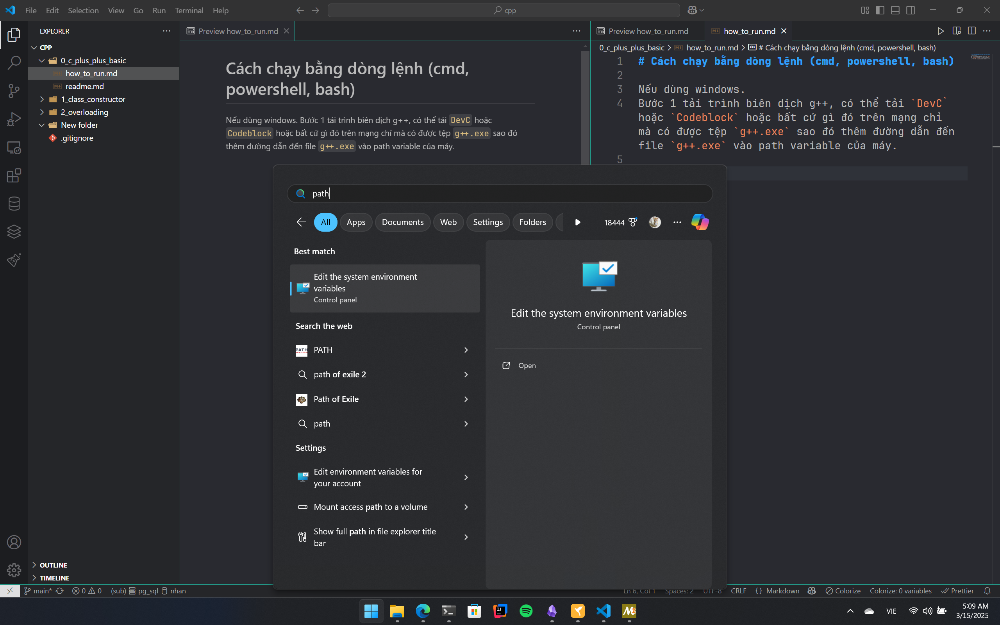
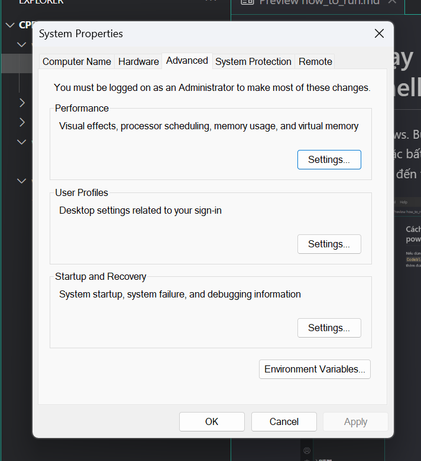
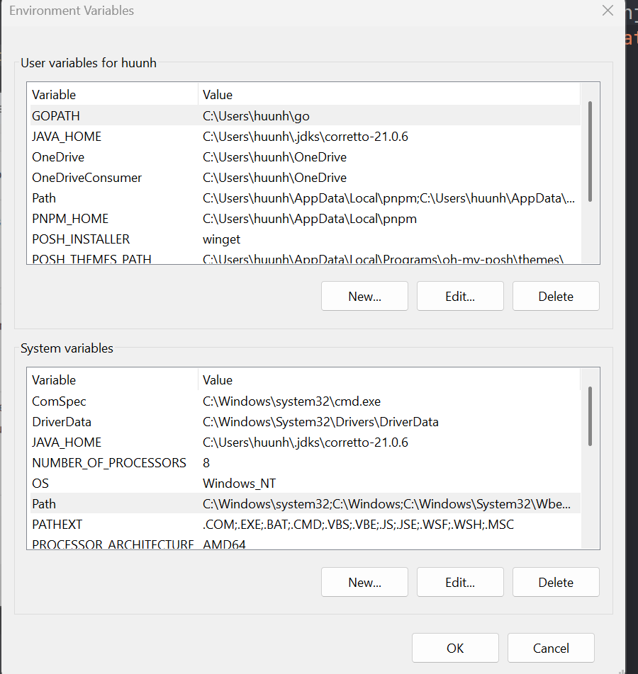

# Cách chạy bằng dòng lệnh (cmd, powershell, bash)

Nếu dùng windows.
Bước 1 tải trình biên dịch g++, có thể tải `DevC` hoặc `Codeblock` hoặc bất cứ gì đó trên mạng chỉ mà có được tệp `g++.exe` sao đó thêm đường dẫn đến file `g++.exe` vào path variable của máy.



- Chonj `Environment Variable`
  

- Chọn `path/edit`

  

- Chọn new và dán đường dẫn đến file `.exe` vào

ví dụ nó nằm ở `C:/Users/username/codeblock/bin/g++.exe` thì điền vào ô là `C:/Users/username/codeblock/bin`.

Sau đó tắt terminal/powershell, cmd. mở lại.

Mở terminal lên và gõ `g++ --version`. Nếu nó có thông tin chứ không phải lỗi là ok.

# tạo file thực thi và chạy code

file `main.cpp`

```c++
#include <iostream>

using namespace std;

int main() {
  cout << "xin chao";
  return 0;
}
```

1. mở terminal vào đường dẫn của file này.
   chạy lệnh `g++ main.cpp`

2. Nó sẽ sinh ra file `a.exe`

3. vào explorer click vào a.exe để chạy (nhưng phải thêm lệnh `system("pause")`) trước lệnh `return 0;` để dùng màn hình nếu không nó chạy return 0 luôn.

Hoặc có thể dùng cmd tiếp bằng cách gõ lệnh `./a.exe` (mở file ./a.exe)

thì kết quả là

```
xin chao
```

## Chỉ định tên file `.exe` được tạo ra.

`source.cpp` là file code. `ouput.exe` là file output có tên mong muốn. (`-o` là output, nếu không dùng thì nó mặc định là a.exe)

```
g++ source.cpp -o output.exe
```

Ví dụ

```
g++ program.cpp -o myprogram.exe
```

Note: mỗi khi sửa code thì phải dịch lại kết quả.

## Cách nâng cao hơn để cài g++, mingw64.

Dùng msys2 trên windows. (Search google nhé.)
