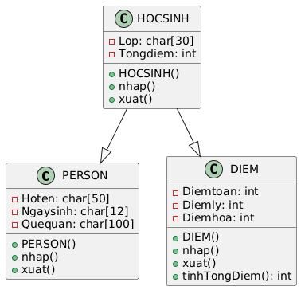
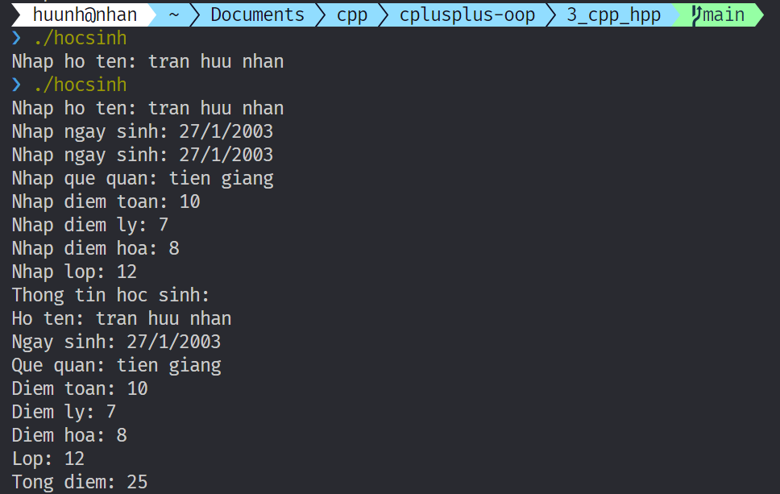

# File .hpp và .cpp trong C++ OOP

## `.hpp` (Header file):

Chứa khai báo của lớp (class declaration), bao gồm:

- Tên lớp
- Các thuộc tính (member variables)
- Các phương thức (member functions)
- Nguyên mẫu hàm (function prototypes)

Được sử dụng để định nghĩa giao diện của lớp, cho phép các file khác biết về sự tồn tại và cách sử dụng lớp.

## `.cpp` (Source file):

Chứa định nghĩa (implementation) của các phương thức đã được khai báo trong file `.hpp`.

- Chứa mã nguồn thực thi của các hàm.

Giúp tách biệt phần giao diện và phần cài đặt của lớp, giúp code dễ quản lý và bảo trì hơn.

---

# Ví dụ với UML này.

- Hình vuông màu đỏ (hoặc dấu `-`) là private
- Hình tròn màu xanh hoặc dấu `+` là public.

<div align="center" style="width='80%'" >
  
  <p>Student UML</p>
</div>

## Code chi tiết xem ở từng file trong thư mục này gồm

- `hocsinh.hpp`: định nghĩa lớp `HOCSINH` (không triển khai phương thức)
- `hocsinh.hpp`: triển khai phương thức
- tương tự với 4 file còn lại gồm `DIEM` và `PERSON`
- file `main.cpp` chứa phần chương trình thực thi. tạo đối tượng HOCSINH và gọi hàm `nhap()`, `xuat()`.

## Cách chạy

gõ lệnh này trên cmd/powershell (phải đảm bảo có g++ trong path)

```pwsh
g++ *.cpp -o hocsinh
```

Ý nghĩa: Biên dịch all file .cpp trong thư mục hiện tại và build thành 1 file thực thi là `hocsinh.exe` (vì windows tự thêm .exe và file này nên ko cần viết thủ công). `hocsinh` là tên file output muốn đặt là gì cũng được, nếu không đặt thì nó mặc định là `a.exe`.

- Sau đó chạy file `hocsinh.exe` bằng cách gõ `./hocsinh.exe` vaf nhập thông tin cần thiết.

## Kết quả.

<div align="center" >
  
</div>

## Câu hỏi

**1. Tại sao trong `.hpp` có lớp rồi mà trong `.cpp` lại định nghĩa lại?**

- **`.hpp` (header file):**
  - Chỉ khai báo (declare) lớp, hàm, biến.
  - Nói cho trình biên dịch biết "cái gì" tồn tại, nhưng không nói "làm thế nào".
  - Giống như mục lục của một cuốn sách, cho bạn biết các chương và tiêu đề, nhưng không chứa nội dung chi tiết.
- **`.cpp` (source file):**
  - Định nghĩa (define) các hàm thành viên của lớp.
  - Triển khai logic cụ thể của các hàm.
  - Giống như nội dung chi tiết của các chương trong cuốn sách.
- **Ví dụ:**
  - Trong `.hpp`, bạn viết: `void xuat();` (khai báo hàm `xuat`).
  - Trong `.cpp`, bạn viết:
    ```c++
    void PERSON::xuat() {
        std::cout << "Ho ten: " << Hoten << std::endl;
        // ...
    }
    ```
    (định nghĩa hàm `xuat` để in thông tin).
- **Lý do:**
  - Tách biệt interface (giao diện) và implementation (triển khai).
  - Giúp tổ chức code, dễ bảo trì và tái sử dụng.
  - Giảm thời gian biên dịch khi chỉ thay đổi implementation.

**2. Tại sao trong `main` chỉ cần import `.hpp` của `student` là dùng được các định nghĩa hàm của `student` triển khai trong `student.cpp`?**

- Khi bạn `#include "student.hpp"`, trình tiền xử lý (preprocessor) sẽ chèn nội dung của `student.hpp` vào file `main.cpp`.
- Trình biên dịch (compiler) sẽ biên dịch `main.cpp`, `student.cpp` thành các object file (`.o` hoặc `.obj`).
- Trình liên kết (linker) sẽ liên kết các object file này lại với nhau, tìm kiếm các định nghĩa hàm được khai báo trong `student.hpp` và tìm thấy chúng trong `student.cpp`.
- Kết quả là file thực thi (`.exe`) chứa code từ cả `main.cpp` và `student.cpp`.

**3. Ví dụ viết thêm `student2.cpp` cũng triển khai `student.hpp` mà theo cách khác thì ở hàm `main` sẽ dùng triển khai hàm nào?**

- Nếu bạn có hai file `student.cpp` và `student2.cpp` cùng triển khai `student.hpp`, trình liên kết sẽ gặp lỗi "multiple definitions" (nhiều định nghĩa).
- Trình liên kết không biết chọn định nghĩa nào để sử dụng.
- **Để khắc phục:**
  - Bạn cần thay đổi tên lớp hoặc hàm trong `student2.cpp`.
  - Hoặc sử dụng namespace để phân biệt các định nghĩa.
  - Hoặc sử dụng biên dịch có điều kiện.
- **Kết luận:** Bạn không thể có hai file `.cpp` cùng định nghĩa cùng một lớp hoặc hàm mà không gây ra lỗi.

**4. Tại sao lại có các câu như `#ifndef HOCSINH_H` và `#defined HOCSINH_H` và `#endif`. Chúng có tác dụng và ý nghĩa gì?**

- **Header guards:**
  - Ngăn chặn việc include một header file nhiều lần.
  - Tránh lỗi "redefinition" (định nghĩa lại).
- **Cách hoạt động:**
  - `#ifndef HOCSINH_H`: Kiểm tra xem macro `HOCSINH_H` đã được định nghĩa chưa.
  - `#define HOCSINH_H`: Định nghĩa macro `HOCSINH_H`.
  - `#endif`: Kết thúc khối lệnh `#ifndef`.
- **Ý nghĩa:**
  - Nếu `HOCSINH_H` chưa được định nghĩa, trình tiền xử lý sẽ include nội dung của `hocsinh.hpp` và định nghĩa `HOCSINH_H`.
  - Nếu `HOCSINH_H` đã được định nghĩa, trình tiền xử lý sẽ bỏ qua nội dung của `hocsinh.hpp`.

**5. Tại sao có nhiều file mà nó dịch thành có 1 file `.exe` cuối vậy?**

- **Quá trình biên dịch và liên kết:**
  1.  **Tiền xử lý (Preprocessing):** Xử lý các chỉ thị tiền xử lý (`#include`, `#define`, ...).
  2.  **Biên dịch (Compilation):** Biên dịch các file `.cpp` thành object file (`.o` hoặc `.obj`).
  3.  **Liên kết (Linking):** Liên kết các object file và thư viện lại với nhau thành file thực thi (`.exe`).
- **Trình liên kết:**
  - Kết hợp code từ các object file.
  - Giải quyết các tham chiếu đến hàm và biến giữa các file.
  - Tạo ra file thực thi duy nhất.
- **Lý do:**
  - Giúp tổ chức code thành các module riêng biệt.
  - Cho phép tái sử dụng code.
  - Giảm thời gian biên dịch khi chỉ thay đổi một phần code.
